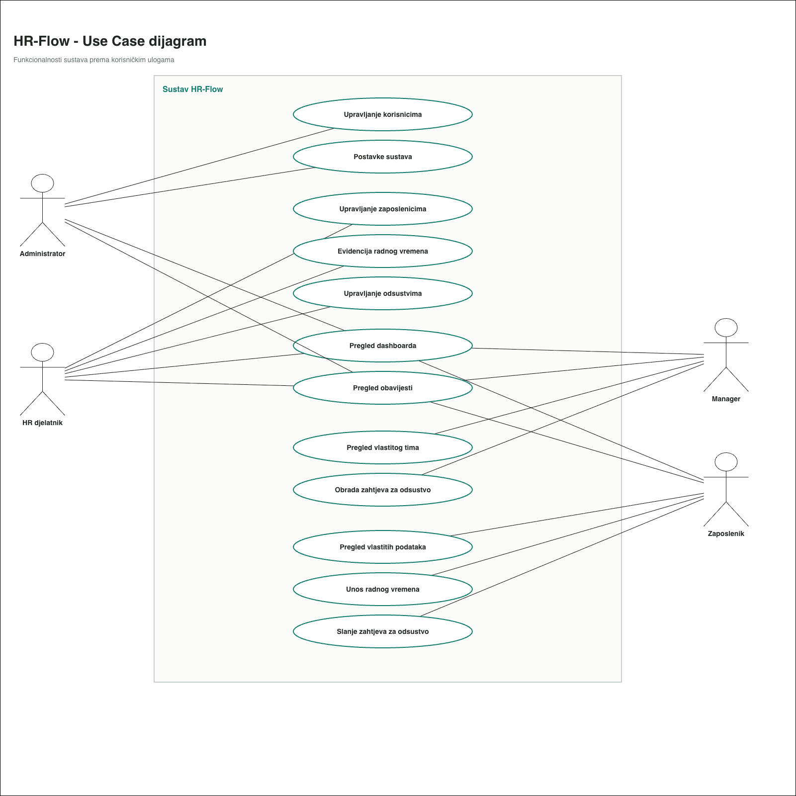
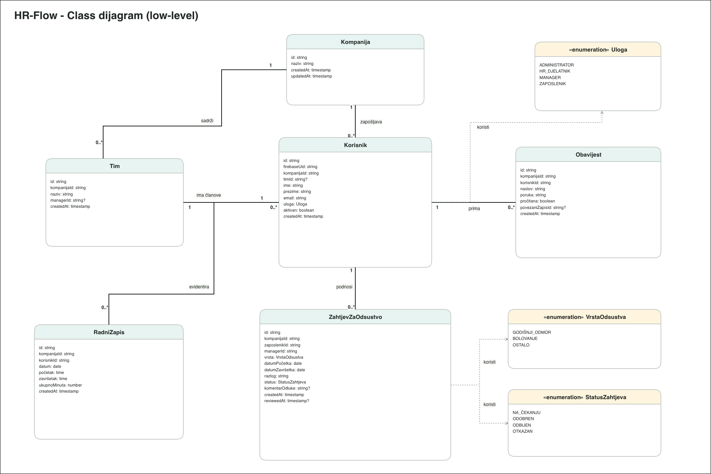

# HR-FLOW

### Projektna dokumentacija

_Centralizirano upravljanje zaposlenicima, radnim vremenom i dopustima_

---

| Podatak            | Vrijednost                                                           |
| ------------------ | -------------------------------------------------------------------- |
| **Kolegij**        | Programsko inženjerstvo                                              |
| **Mentor**         | doc. dr. sc. Nikola Tanković                                         |
| **Autor**          | Tomislav Mikulčić                                                    |
| **Ustanova**       | Fakultet informatike u Puli, Sveučilište Jurja Dobrile u Puli        |
| **Repozitorij**    | [github.com/tmikulcic/HR-Flow](https://github.com/tmikulcic/HR-Flow) |
| **Web aplikacija** | [hr-flow-pi.netlify.app](https://hr-flow-pi.netlify.app)             |

Pula, 2026.

## Sadržaj

1. [Sažetak](#1-sažetak)
2. [Uvod i motivacija](#2-uvod-i-motivacija)
3. [Razrada funkcionalnosti](#3-razrada-funkcionalnosti)
4. [Implementacija](#4-implementacija)
5. [Korisničke upute](#5-korisničke-upute)
6. [Zaključak i moguća proširenja](#6-zaključak-i-moguća-proširenja)
7. [Dodaci](#7-dodaci)

## 1. Sažetak

HR-Flow je web aplikacija za centralizirano upravljanje osnovnim procesima ljudskih resursa unutar kompanije. Na jednom mjestu povezuje podatke o zaposlenicima, organizacijskim timovima, radnom vremenu, zahtjevima za dopust i obavijestima. Time smanjuje potrebu za paralelnim korištenjem tablica, poruka elektroničke pošte i odvojenih evidencija koje je teško održavati usklađenima.

Aplikacija razlikuje četiri korisničke uloge: **Administrator**, **HR**, **Manager** i **Employee**. Svaka uloga dobiva prilagođenu navigaciju, dashboard i pristup samo onim podacima koji su joj potrebni. Administrator upravlja korisnicima, timovima i postavkama kompanije. HR vodi imenik zaposlenika i njihove poslovne podatke. Manager prati izravno podređene zaposlenike i odlučuje o njihovim zahtjevima za dopust. Employee evidentira vlastito radno vrijeme, šalje zahtjeve za dopust i prati obavijesti.

Korisničko sučelje izrađeno je u Vue 3 frameworku, navigacija se provodi pomoću Vue Routera, a vizualni sustav pomoću Tailwind CSS-a. Firebase Authentication upravlja prijavom i korisničkom sesijom, dok Cloud Firestore sprema aplikacijske podatke. Produkcijska verzija gradi se Viteom i objavljena je na Netlifyju.

Podatkovni model predviđa odvajanje podataka po kompanijama pomoću atributa `companyId`. Trenutačna demonstracijska konfiguracija sadrži kompaniju Northstar Labs i povezane podatke za sve četiri uloge. Opseg je namjerno prilagođen jasnom i održivom projektnom rješenju, bez dodatnog backend servera i bez funkcionalnosti koje nisu nužne za prikaz glavnih HR procesa.

Dokumentacija opisuje motivaciju i korisnike, funkcionalnosti po ulogama, domenski model, implementacijsku arhitekturu, sigurnosni pristup, korisničke upute i poznata ograničenja aktualne verzije.

## 2. Uvod i motivacija

### 2.1. Opis aplikacije

HR-Flow je namijenjen organizacijama koje žele voditi osnovne HR evidencije kroz jedno pregledno web sučelje. Središnji objekt sustava je zaposlenik, uz kojeg se vežu korisnički račun, organizacijski tim, manager, evidencija radnog vremena, zahtjevi za dopust i obavijesti.

Nakon prijave korisnik dolazi na dashboard čiji se sadržaj prilagođava njegovoj ulozi. Zaposlenik vidi osobne pokazatelje i vlastite aktivnosti, manager dobiva sažetak tima i zahtjeva koji čekaju odluku, a HR i Administrator pregled kompanije. Sidebar prikazuje samo stranice za koje trenutna uloga ima dopuštenje.

Aplikacija pokriva sljedeće poslovne cjeline:

- imenik zaposlenika i detaljne profile;
- tjednu evidenciju radnog vremena;
- godišnji odmor i druge vrste dopusta;
- managersko odlučivanje o zahtjevima;
- pregled timova i dostupnosti;
- obavijesti o važnim događajima;
- administraciju korisničkog pristupa i organizacijskih podataka.

### 2.2. Problem i motivacija

Manje organizacije često započinju vođenje HR procesa u proračunskim tablicama. Podaci zaposlenika nalaze se u jednoj datoteci, evidencija vremena u drugoj, a zahtjevi za dopust šalju se porukama. Takav pristup je dovoljan dok je broj zaposlenika malen, ali s vremenom nastaju problemi:

- isti se podatak ponavlja na više mjesta;
- nije jasno koja je verzija podatka aktualna;
- zaposlenici nemaju jednostavan pregled vlastitog stanja;
- manageri odluke donose bez jedinstvenog pregleda dostupnosti tima;
- promjene se teško prate i prenose svim uključenim osobama;
- pristup podacima najčešće nije prilagođen korisničkoj ulozi.

Motivacija za HR-Flow je objediniti te procese u jednostavan sustav u kojem svaki događaj mijenja zajednički skup podataka. Kada Employee pošalje zahtjev za dopust, Manager ga vidi među zahtjevima za odobrenje. Nakon odluke Employee vidi novi status, komentar i obavijest, a izračun raspoloživih dana automatski se ažurira.

### 2.3. Ciljani korisnici

Primarni korisnici su manje i srednje kompanije kojima treba jednostavna interna aplikacija bez širine velikih poslovnih HR platformi. Sustav je posebno prikladan organizacijama koje imaju jasnu strukturu timova i managere odgovorne za odobravanje dopusta.

Četiri skupine neposrednih korisnika su:

- **Administrator**, zadužen za pristup sustavu i organizacijsku konfiguraciju;
- **HR**, zadužen za evidenciju zaposlenika i administrativne procese;
- **Manager**, zadužen za tim i odluke o dopustima;
- **Employee**, koji upravlja vlastitim podacima vezanima uz vrijeme i dopust.

### 2.4. Postojeća i konkurentska rješenja

HR-Flow ne pokušava zamijeniti sve funkcionalnosti velikog HRIS sustava. Fokus je na procesima koji se u manjim organizacijama najčešće vode kroz nekoliko nepovezanih alata.

Na tržištu postoje komercijalne HR platforme kao što su BambooHR, Personio i Factorial. One pokrivaju širi skup procesa, dok je HR-Flow usmjeren na manji broj osnovnih funkcionalnosti: zaposlenike, radno vrijeme, dopuste, timove i obavijesti. Takav opseg čini aplikaciju jednostavnijom za manje kompanije kojima nisu potrebni moduli poput obračuna plaće ili upravljanja velikim brojem dokumenata.

| Način rada                | Prednosti                                                | Ograničenja koja HR-Flow adresira                                                  |
| ------------------------- | -------------------------------------------------------- | ---------------------------------------------------------------------------------- |
| Proračunske tablice       | Poznate su korisnicima i brzo se izrađuju                | Nema uloga, centralne validacije, automatskih obavijesti ni jasne povijesti odluka |
| Elektronička pošta i chat | Jednostavno slanje zahtjeva                              | Zahtjevi se gube među porukama i saldo se mora računati odvojeno                   |
| Kalendar                  | Dobar pregled odsutnosti                                 | Ne vodi proces zahtjeva, odobrenja i prava na dopust                               |
| Komercijalne HR platforme | Širok skup mogućnosti                                    | Za mali tim mogu biti složenije i opsežnije od stvarne potrebe                     |
| HR-Flow                   | Jedinstven tok za zaposlenike, vrijeme, dopuste i timove | Trenutačni MVP nema obračun plaće, dokumente zaposlenika ni napredno izvještavanje |

### 2.5. SWOT analiza

| Snage                                                  | Slabosti                                                        |
| ------------------------------------------------------ | --------------------------------------------------------------- |
| Jasna podjela ovlasti između četiri uloge              | Nema vlastiti backend ni administrativne Cloud Functions        |
| Povezani podaci zaposlenika, vremena, dopusta i timova | Nema real-time Firestore listenera nakon inicijalnog učitavanja |
| Responsive sučelje prilagođeno mobitelu i desktopu     | Nema automatizirane testove ni napredno izvještavanje           |
| Podaci su odvojeni pomoću `companyId` vrijednosti      | Demonstracijsko okruženje konfigurira samo jednu kompaniju      |
| Firebase Authentication i Firestore Security Rules     | Poziv zaposlenika ne stvara automatski Firebase Auth račun      |

| Prilike                                                       | Prijetnje                                                                   |
| ------------------------------------------------------------- | --------------------------------------------------------------------------- |
| Dodavanje izvještaja, kalendara odsutnosti i izvoza podataka  | Pogrešno postavljena Firestore pravila mogu ugroziti privatnost HR podataka |
| Automatsko slanje pozivnica i povezivanje s poslovnim emailom | Rast podataka može zahtijevati paginaciju i drukčiji način učitavanja       |
| Evidencija državnih praznika i različitih radnih rasporeda    | Ovisnost o dostupnosti i cjenovnom modelu Firebase platforme                |
| Razvoj SaaS modela za više kompanija                          | Promjena emaila zahtijeva usklađivanje Auth, User i Membership zapisa       |

### 2.6. Preduvjeti za korištenje

Za lokalni razvoj i produkcijski rad potrebni su:

- suvremeni web preglednik s podrškom za JavaScript module;
- Node.js i npm za lokalno pokretanje i build;
- Firebase projekt s uključenim Authenticationom i Cloud Firestoreom;
- Firebase web aplikacija i pripadajuće konfiguracijske vrijednosti;
- objavljena Firestore sigurnosna pravila i potrebni indeksi;
- HTTPS hosting za produkcijsku verziju;
- Firebase Authentication račun povezan s HR-Flow Membership zapisom.

### 2.7. Koristi sustava

**Kompanija** dobiva jedinstven izvor podataka za osnovne HR procese i jasnije razdvajanje odgovornosti.

**Vodstvo kompanije** dobiva pouzdaniji pregled zaposlenika, prisutnosti i planiranih odsutnosti, što olakšava organizaciju rada i raspodjelu resursa.

**HR djelatnik** lakše održava imenik i poslovne podatke zaposlenika te vidi evidenciju kompanije bez ručnog spajanja više tablica.

**Manager** dobiva pregled članova tima, njihove dostupnosti i zahtjeva koji čekaju odluku.

**Employee** samostalno evidentira radno vrijeme, prati saldo dopusta, šalje zahtjeve i dobiva povratnu informaciju o odluci.

## 3. Razrada funkcionalnosti

### 3.1. Korisničke uloge

Pristup se određuje kombinacijom Firebase prijave, HR-Flow Membership zapisa, statusa korisničkog pristupa i uloge spremljene u `User` dokumentu.

#### 3.1.1. Neprijavljeni korisnik

Neprijavljeni korisnik može otvoriti samo stranicu **Sign in**. Pokušaj pristupa privatnoj ruti preusmjerava ga na prijavu i sprema prvotno traženu adresu kako bi se nakon uspješne prijave mogao vratiti na nju.

Registracija nije javno dostupna. Korisnički identitet mora postojati u Firebase Authenticationu, a njegov email mora imati odgovarajući HR-Flow Membership zapis.

#### 3.1.2. Administrator

Administrator ima najširi opseg funkcionalnosti:

- pregled kompanijskog dashboarda;
- pregled, dodavanje i uređivanje zaposlenika;
- pregled i uređivanje evidencije vremena zaposlenika;
- upravljanje vlastitim zahtjevima za dopust;
- pregled vlastitih obavijesti;
- pozivanje korisnika i upravljanje ulogama i pristupom;
- dodavanje i uređivanje timova;
- uređivanje naziva kompanije i vremenske zone.

Administrator ne koristi managerske stranice **My team** i **Approvals**, jer su one namijenjene izravno nadređenim osobama.

#### 3.1.3. HR

HR djelatnik može:

- pregledavati kompanijski dashboard;
- pregledavati, dodavati i uređivati zaposlenike;
- pregledavati i uređivati evidenciju vremena zaposlenika;
- upravljati vlastitim dopustima i obavijestima.

HR nema pristup stranici **Administration** i ne odlučuje kroz managerski **Approvals** prikaz.

#### 3.1.4. Manager

Manager može:

- pregledavati dashboard prilagođen timu;
- upravljati vlastitim vremenom i dopustom;
- pregledavati izravno podređene zaposlenike;
- pratiti tjedne sate i dostupnost članova tima;
- pregledavati zahtjeve iz vlastitog opsega;
- odobriti ili odbiti pending zahtjev;
- pregledavati vlastite obavijesti.

Manager nema pristup kompanijskom imeniku niti administraciji.

#### 3.1.5. Employee

Employee može:

- pregledavati osobni dashboard;
- pregledavati vlastiti profil;
- dodavati i uređivati vlastitu evidenciju vremena;
- pregledavati saldo i povijest dopusta;
- poslati novi zahtjev i povući ga dok je pending;
- pregledavati i označavati obavijesti pročitanima.

### 3.2. Matrica funkcionalnog pristupa

| Funkcionalnost                        | Administrator | HR  | Manager | Employee |
| ------------------------------------- | :-----------: | :-: | :-----: | :------: |
| Dashboard                             |       ✓       |  ✓  |    ✓    |    ✓     |
| Company employee directory            |       ✓       |  ✓  |    —    |    —     |
| Pregled vlastitog profila             |       ✓       |  ✓  |    ✓    |    ✓     |
| Pregled izravno podređenog            |       —       |  —  |    ✓    |    —     |
| Dodavanje i uređivanje zaposlenika    |       ✓       |  ✓  |    —    |    —     |
| Evidencija vlastitog vremena          |       ✓       |  ✓  |    ✓    |    ✓     |
| Evidencija vremena drugih zaposlenika |       ✓       |  ✓  |    —    |    —     |
| Vlastiti zahtjevi za dopust           |       ✓       |  ✓  |    ✓    |    ✓     |
| Pregled vlastitog tima                |       —       |  —  |    ✓    |    —     |
| Odluka o dopustu podređenih           |       —       |  —  |    ✓    |    —     |
| Obavijesti                            |       ✓       |  ✓  |    ✓    |    ✓     |
| Upravljanje korisnicima i timovima    |       ✓       |  —  |    —    |    —     |
| Postavke kompanije                    |       ✓       |  —  |    —    |    —     |

### 3.3. Funkcionalne cjeline

#### Dashboard

Dashboard je početna privatna stranica. Sadržaj se izvodi iz podataka dopuštenog opsega i prilagođava ulozi. Prikazuje četiri ključna pokazatelja, tjednu evidenciju, dostupnost tima ili kompanije, nedavne aktivnosti i poveznice prema najčešćim radnjama.

#### Employees

Imenik je dostupan Administratoru i HR-u. Omogućuje pretragu po imenu i emailu te filtriranje prema timu i statusu zaposlenja. Profil zaposlenika sadrži pregled osobnih i poslovnih podataka, evidenciju vremena, povijest dopusta, saldo i organizacijske odnose.

#### Time tracking

Stranica prikazuje pet radnih dana odabranog tjedna. Iz zapisa računa ukupne sate, dnevni prosjek, prekovremeni rad i postotak popunjenosti. Korisnik može koristiti brzi unos ili detaljni modal s pauzom. Administrator i HR mogu odabrati drugog zaposlenika, dok Manager i Employee uređuju samo vlastite zapise.

#### My leave

Prikazuje godišnje pravo, iskorištene, pending i preostale dane. Zahtjevi se mogu filtrirati prema statusu i otvoriti u detaljnom prikazu. Novi zahtjev sadrži vrstu dopusta, raspon datuma i razlog. Pending zahtjev vlasnik može povući.

#### My team

Manager vidi izravno podređene zaposlenike, njihovu trenutačnu dostupnost, tjedne sate i postotak prema standardnom radnom tjednu. Popis se može pretraživati i pomicati po tjednima.

#### Approvals

Manager vidi pending zahtjeve podređenih i povijest vlastitih odluka. Prije odluke može pregledati preklapanja s drugim odobrenim dopustima. Odluka mijenja status zahtjeva, sprema komentar i stvara obavijest zaposleniku.

#### Notifications

Centar obavijesti prikazuje samo zapise prijavljenog korisnika. Dostupni su filtri **All** i **Unread**, otvaranje povezane stranice te radnja **Mark all as read**. Preference vrsta obavijesti spremaju se lokalno u preglednik.

#### Administration

Administratorska stranica sadrži tabove **Users and access**, **Teams** i **Company**. Administrator može pozvati korisnika, promijeniti ulogu i status pristupa, dodati ili urediti tim te promijeniti naziv kompanije i vremensku zonu.

### 3.4. Dijagram obrazaca uporabe



Dijagram prikazuje četiri glavna aktera i funkcionalnosti dostupne svakom od njih. Administrator i HR povezani su s upravljanjem zaposlenicima, Manager s pregledom tima i odlukama o zahtjevima, a Employee s vlastitim vremenom i dopustima. Zajedničke funkcionalnosti, kao što su prijava, dashboard i obavijesti, koriste sve četiri uloge.

Izvorna datoteka dijagrama nalazi se u [Draw.io formatu](./use-case.drawio) i može se uređivati online u diagrams.net editoru.

### 3.5. Komunikacija s vanjskim sustavima

HR-Flow nema vlastiti aplikacijski backend. Preglednik komunicira sa sljedećim vanjskim sustavima:

**Firebase Authentication** provjerava email i lozinku, održava trajanje sesije, prijavljuje promjene auth stanja, provodi odjavu i šalje email za reset lozinke. Lozinke se ne spremaju u Firestore niti u kod aplikacije.

**Cloud Firestore** sprema domenske dokumente i provodi Security Rules. Aplikacija nakon prijave dohvaća samo podatke potrebne trenutnoj ulozi, sprema ih u memorijski cache i šalje promjene kroz red asinkronih zapisa.

**Netlify** poslužuje statički Vite build preko HTTPS-a. SPA redirect vraća `index.html` za izravno otvorene Vue rute, nakon čega Vue Router preuzima navigaciju u pregledniku.

Firebase Authentication sudjeluje u obrascima prijave, odjave i promjene lozinke. Cloud Firestore sudjeluje u svim obrascima koji čitaju ili mijenjaju zaposlenike, vrijeme, dopuste, timove i obavijesti. Netlify nema pristup poslovnim podacima, nego pruža infrastrukturu preko koje se aplikacija isporučuje korisniku.

### 3.6. Glavni korisnički scenariji

#### Scenarij 1: prijava u sustav

_Akter:_ bilo koji aktivni korisnik.

_Preduvjet:_ postoje Firebase Auth račun, Membership i aktivni User zapis.

1. Korisnik otvara stranicu **Sign in**.
2. Upisuje email i lozinku te bira želi li trajnu sesiju pomoću **Remember me** opcije.
3. Firebase Authentication potvrđuje identitet.
4. Aplikacija pronalazi Membership prema normaliziranom emailu.
5. Učitavaju se User, Employee, Company i ostali podaci dopuštenog opsega.
6. Session store sprema aktivni kontekst.
7. Router otvara prvotno traženu stranicu ili **Dashboard**.

_Iznimka:_ Firebase identitet postoji, ali nema valjani Membership ili aktivni User zapis. Aplikacija prekida uspostavu sesije i odjavljuje korisnika.

#### Scenarij 2: unos radnog vremena

_Akter:_ Employee, Manager, HR ili Administrator.

_Preduvjet:_ korisnik ima povezani Employee zapis.

1. Korisnik otvara **Time tracking**.
2. Bira tjedan, a Administrator ili HR po potrebi biraju zaposlenika.
3. Otvara brzi ili detaljni unos.
4. Upisuje datum, početak, završetak i pauzu.
5. Service provjerava radni dan, redoslijed vremena, pauzu i duplikate.
6. Izračunava se ukupno trajanje u minutama.
7. Repository odmah ažurira lokalni cache i stavlja Firestore zapis u red.
8. Tjedni sažetak ponovno se izračunava.

#### Scenarij 3: zahtjev za dopust i odluka

_Akteri:_ Employee i Manager.

_Preduvjet:_ Employee ima dodijeljenog managera ili drugog dopuštenog reviewera.

1. Employee otvara **My leave** i bira **Request leave**.
2. Odabire vrstu, početni i završni datum te upisuje razlog.
3. Aplikacija računa samo radne dane i provjerava preklapanje i raspoloživi saldo.
4. Sprema se pending zahtjev i obavijest revieweru.
5. Manager otvara **Approvals** i provjerava pokrivenost tima.
6. Manager odobrava ili odbija zahtjev te opcionalno upisuje komentar.
7. Zahtjev dobiva konačni status i vrijeme odluke.
8. Employee prima obavijest te vidi ažurirani status i saldo.

_Alternativni tok:_ Employee povlači zahtjev prije managerske odluke. Status prelazi iz `pending` u `withdrawn`.

#### Scenarij 4: održavanje zaposlenika

_Akter:_ Administrator ili HR.

_Preduvjet:_ korisnik ima ovlast `manage_employees`.

1. Korisnik otvara **Employees**.
2. Pretražuje postojeći zapis ili bira **Add employee**.
3. Unosi osobne, poslovne i organizacijske podatke.
4. Service provjerava obavezna polja, email, tim, managera, ulogu i godišnje pravo.
5. Za novog zaposlenika stvaraju se Employee, User i Membership zapisi.
6. Za postojeći zapis mijenjaju se dopuštena polja.
7. Imenik i profil prikazuju spremljene promjene.

_Napomena:_ ovaj postupak ne stvara Firebase Authentication identitet ni početnu lozinku.

#### Scenarij 5: administracija workspacea

_Akter:_ Administrator.

_Preduvjet:_ aktivna administratorska sesija.

1. Administrator otvara **Administration**.
2. Na tabu **Users and access** upravlja ulogom, timom i statusom pristupa.
3. Na tabu **Teams** dodaje ili uređuje tim i njegova managera.
4. Na tabu **Company** mijenja naziv i vremensku zonu.
5. Service provjerava pripadaju li svi zapisi istoj kompaniji.
6. Promjene se spremaju u Firestore i prikaz se osvježava.

### 3.7. Domenski klasni dijagram



Klasni dijagram prikazuje poslovne informacije, a ne Vue komponente. Kompanija sadrži korisnike i timove, tim okuplja više korisnika, a korisnik može imati više radnih zapisa, zahtjeva za odsustvo i obavijesti. Zahtjev za odsustvo koristi enumeracije vrste i statusa, dok korisnik koristi enumeraciju uloge.

Prikazane veze su obične asocijacije s kardinalnostima. Kompozicija se ne koristi jer se povezani zapisi u Firestoreu spremaju u zasebne kolekcije i imaju vlastite identifikatore. Dijagram je radi čitljivosti pojednostavljen: implementacija dodatno razdvaja aplikacijski `User` od poslovnog `Employee` zapisa, dok tehnički `Membership` povezuje Firebase email s korisnikom i kompanijom.

Izvorna verzija dostupna je u [Draw.io formatu](./class-diagram.drawio).

### 3.8. Nabrajanja i statusi

Umjesto slobodnog teksta, važna stanja definirana su centralnim enumeracijama. Time se izbjegavaju različiti zapisi iste vrijednosti i olakšavaju validacija, filtriranje i prikaz statusnih oznaka.

| Područje          | Dopuštene vrijednosti                          |
| ----------------- | ---------------------------------------------- |
| Korisnička uloga  | `administrator`, `hr`, `manager`, `employee`   |
| Pristup sustavu   | `active`, `invited`, `disabled`                |
| Status zaposlenja | `active`, `on_leave`, `inactive`               |
| Vrsta zaposlenja  | `full_time`, `part_time`, `contractor`         |
| Status vremena    | `complete`, `missing`                          |
| Vrsta dopusta     | `annual`, `sick`, `other`                      |
| Status zahtjeva   | `pending`, `approved`, `declined`, `withdrawn` |

## 4. Implementacija

### 4.1. Tehnologije

| Tehnologija  | Verzija u projektu | Uloga                                         |
| ------------ | ------------------ | --------------------------------------------- |
| Vue          | 3.5.40             | Komponente, Composition API i reaktivnost     |
| Vue Router   | 4.6.4              | Navigacija, nested layout i zaštita ruta      |
| Vite         | 8.1.5              | Razvojni server i produkcijski build          |
| Tailwind CSS | 4.3.3              | Dizajnerski tokeni i responsive utility klase |
| Firebase SDK | 12.17.1            | Authentication i Cloud Firestore              |
| JavaScript   | ES modules         | Domenski, servisni i podatkovni sloj          |
| Netlify      | statički hosting   | Produkcijski build, HTTPS i SPA routing       |

Projekt namjerno ne koristi Piniju, Vuex, TypeScript ni dodatni UI framework. Globalna sesija implementirana je malim Vue storeom, a poslovna pravila nalaze se u običnim JavaScript servisima.

### 4.2. Organizacija projekta

```text
HR-Flow/
├── docs/                    Projektni dijagrami, prototip i dokumentacija
├── src/
│   ├── components/          Višekratno upotrebljive UI i modal komponente
│   ├── data/                Demonstracijski povezani podaci
│   ├── domain/              Modeli, enumeracije i matrica ovlasti
│   ├── layouts/             Glavni layout prijavljene aplikacije
│   ├── pages/               Vue komponente povezane s rutama
│   ├── repositories/        Cache, CRUD sučelje i Firestore sinkronizacija
│   ├── router/              Rute i globalni route guard
│   ├── services/            Poslovna pravila, validacije i view modeli
│   ├── stores/              Globalni store korisničke sesije
│   ├── App.vue              Korijenski RouterView
│   ├── firebase.js          Firebase inicijalizacija
│   ├── main.js              Pokretanje aplikacije
│   └── style.css            Tailwind tema i globalni stilovi
├── firestore.rules          Sigurnosna pravila baze
├── firestore.indexes.json   Složeni Firestore indeksi
├── firebase.json            Firebase CLI konfiguracija
├── netlify.toml             Produkcijski build i SPA redirect
├── package.json             NPM skripte i ovisnosti
└── vite.config.js           Vue i Tailwind Vite pluginovi
```

### 4.3. Arhitektura

Korisnička radnja započinje u Vue stranici ili komponenti. Ona poziva odgovarajući poslovni service, koji validira podatke i zatim koristi repository sloj. Repository odmah ažurira memorijski cache, a promjenu dodaje u red asinkronih zapisa prema Cloud Firestoreu.

Firebase Authentication zasebno potvrđuje identitet korisnika. Session store na temelju prijavljenog identiteta pokreće učitavanje podataka prema ulozi te izlaže aktivnog korisnika, zaposlenika, kompaniju i ulogu. Router guard koristi taj kontekst za zaštitu stranica, dok se stvarni pristup dokumentima dodatno provjerava Firestore Security Rules pravilima.

Slojevi imaju odvojene odgovornosti:

1. **Pages i components** prikazuju sučelje i obrađuju korisničke događaje.
2. **Services** provode validaciju, poslovne izračune i pripremu podataka za prikaz.
3. **Repositories** pružaju jednostavne metode `get`, `add`, `update` i `remove`.
4. **Firestore database adapter** učitava dopušteni opseg i upravlja redom zapisa.
5. **Session store** povezuje Firebase identitet s HR-Flow korisnikom i kompanijom.
6. **Router i Security Rules** odvojeno provjeravaju smije li korisnik pristupiti podatku ili stranici.

Vue komponente ne koriste Firestore SDK izravno. Takva podjela omogućuje promjenu načina spremanja podataka bez prepravljanja svakog zaslona.

### 4.4. Pokretanje i obnova sesije

`src/main.js` prije montiranja Vue aplikacije čeka `initializeSession()`. Firebase listener zatim javlja postoji li aktivni Auth user.

Ako korisnik postoji, slijedi ovaj tok:

```text
Firebase Auth user
→ Membership prema normaliziranom emailu
→ HR-Flow User i status pristupa
→ Employee i Company
→ role-scoped Firestore podaci
→ session store
→ router odluka
```

Store izlaže readonly vrijednosti `currentUser`, `currentEmployee`, `currentCompany`, `currentRole`, `isAuthenticated` i `isInitialized`. Prilikom odjave najprije čeka završetak zapisa koji su već stavljeni u Firestore red, a zatim prazni auth sesiju i memorijske podatke.

### 4.5. Prijava i zaštita ruta

`authService.js` koristi Firebase email/password prijavu. Opcija **Remember me** bira između trajne `browserLocalPersistence` sesije i sesije vezane uz otvoreni browser pomoću `browserSessionPersistence`.

Globalni Vue Router guard provjerava:

- je li ruta namijenjena samo gostu;
- zahtijeva li prijavu;
- ima li trenutačna uloga traženu permission vrijednost;
- smije li korisnik otvoriti konkretni profil zaposlenika.

Neprijavljeni korisnik preusmjerava se na `/login`. Korisnik bez permissiona vraća se na `/dashboard`. Manager smije otvoriti vlastiti profil i profil izravno podređenog, dok Employee smije otvoriti samo vlastiti profil.

### 4.6. Podatkovni sloj

Firestore koristi sljedeće top-level kolekcije:

- `companies`;
- `users`;
- `employees`;
- `teams`;
- `timeEntries`;
- `leaveRequests`;
- `notifications`;
- `memberships`.

Svaki poslovni zapis, osim samog Membership identifikatora, sadrži stabilni ID. Zapisi vezani uz kompaniju sadrže `companyId`, koji je osnova za filtriranje i sigurnosna pravila.

Repository sloj prvo mijenja memorijski cache kako bi se rezultat odmah prikazao korisniku. Firestore operacija dodaje se u sekvencijalni red zapisa. Time se održava jednostavno i brzo sučelje, a pri odjavi aplikacija čeka da red završi.

Role-scoped učitavanje razlikuje tri opsega:

- **Administrator i HR** učitavaju podatke cijele kompanije;
- **Manager** učitava sebe, izravno podređene, relevantne timove, vremena, dopuste i vlastite obavijesti;
- **Employee** učitava vlastite zapise te minimum podataka o manageru, timu i reviewerima potreban za prikaz.

### 4.7. Poslovni servisi

| Service                      | Glavna odgovornost                                        |
| ---------------------------- | --------------------------------------------------------- |
| `authService`                | Prijava, persistence, reset lozinke i auth greške         |
| `dashboardService`           | KPI podaci, tjedna evidencija, dostupnost i aktivnosti    |
| `employeeService`            | Imenik, filteri i obogaćivanje podataka zaposlenika       |
| `employeeProfileService`     | Detaljni profil, saldo, vrijeme i povijest dopusta        |
| `employeeManagementService`  | Validacija i spremanje Employee, User i Membership zapisa |
| `timeTrackingService`        | Tjedni read model i sažetak evidentiranih sati            |
| `timeEntryManagementService` | Validacija i spremanje evidencije vremena                 |
| `leaveOverviewService`       | Vlastiti saldo, statusi i budući dopusti                  |
| `leaveRequestService`        | Novi zahtjev, radni dani, preklapanja i povlačenje        |
| `leaveApprovalService`       | Managerski opseg, pokrivenost i odluke                    |
| `managerTeamService`         | Članovi tima, dostupnost i tjedni sati                    |
| `notificationService`        | Obavijesti, unread stanje, navigacija i preference        |
| `administrationService`      | Useri, pristup, timovi i kompanijske postavke             |
| `membershipService`          | Održavanje veze između emaila, Usera i kompanije          |

Servisi vraćaju strukture prilagođene prikazu kako Vue templatei ne bi sadržavali složene poslovne izračune.

### 4.8. Ključna poslovna pravila

#### Evidencija vremena

- datum mora biti valjan radni dan od ponedjeljka do petka;
- završetak mora biti nakon početka;
- pauza mora biti nenegativan cijeli broj i kraća od radnog razdoblja;
- zaposlenik može imati samo jedan zapis po datumu;
- ukupne minute računaju se iz početka, završetka i pauze;
- standardni dan traje osam sati, a standardni tjedan četrdeset sati.

#### Zahtjevi za dopust

- početak ne smije biti u prošlosti;
- završetak ne smije biti prije početka;
- vikendi se ne računaju u trajanje;
- zahtjev mora sadržavati razlog;
- novi zahtjev ne smije se preklapati s pending ili approved zahtjevom;
- godišnji odmor ne smije prijeći raspoloživi saldo;
- samo se pending zahtjev može povući, odobriti ili odbiti;
- managerska odluka sprema status, komentar i vrijeme odluke.

#### Administracija

- sve administratorske promjene moraju ostati unutar iste kompanije;
- Administrator ne može sam sebi ukloniti administratorski pristup;
- samo Administrator uređuje timove i kompanijske postavke;
- HR može održavati zaposlenike, ali ne može postaviti drugog Administratora;
- dodavanje Employee zapisa ne znači automatsko stvaranje Firebase Auth računa.

### 4.9. Implementacija ključnih funkcionalnosti

Ključne funkcionalnosti povezane su kroz Vue viewove, višekratne komponente, poslovne servise i repository sloj. View upravlja stanjem trenutačnog zaslona i korisničkim događajima, komponenta prikazuje pojedini dio sučelja, service provodi poslovna pravila, a repository čita ili sprema podatke.

#### Prijava i uspostava sesije

`LoginPage` je Vue view koji upravlja vrijednostima `email`, `password` i `rememberMe`, validacijskim objektom `errors`, porukom `formMessage` i stanjem `isSubmitting`. Metode `validateForm()`, `handleSubmit()` i `handleForgotPassword()` obrađuju unos i korisničke radnje. Polja emaila i lozinke prikazuju se pomoću komponente `AppInput`, a slanje obrasca pomoću komponente `AppButton`.

Nakon slanja obrasca `LoginPage` poziva `signInWithCredentials()` iz `authService.js`. Service postavlja odgovarajuće trajanje sesije i šalje podatke Firebase Authenticationu. Nakon uspješne provjere identiteta `initializeFirestoreDatabase()` učitava Membership, User, Employee i Company zapise te ostale podatke dopuštene korisničkoj ulozi.

`SessionStore` zatim sprema reference `currentUser`, `currentEmployee`, `currentCompany` i `currentRole`. Router koristi te vrijednosti za provjeru pristupa i nakon prijave otvara dashboard ili prvotno zatraženu rutu. Reset lozinke koristi isti view, ali poziva `requestPasswordReset()` iz auth servicea.

#### Slanje i obrada zahtjeva za dopust

`NewLeaveRequestPage` je Vue view koji čuva podatke obrasca, validacijske greške, izračunani pregled zahtjeva i stanje slanja. Polja obrasca prikazuju se kroz `AppInput` i `AppSelect`, dok `getLeaveRequestPreview()` iz `leaveRequestService.js` računa broj radnih dana, reviewera i očekivani saldo.

Metoda za slanje poziva `saveLeaveRequest()`. Service provjerava datume, preklapanja, razlog i raspoloživi godišnji odmor. Valjani zahtjev sprema se pomoću `leaveRequestRepository` sa statusom `pending`, a `notificationService` stvara obavijest za reviewera.

Manager zahtjeve obrađuje na viewu `ApprovalsPage`. Njegovo lokalno stanje uključuje `selectedRequestId`, `sortOrder`, `decisionType` i `dataVersion`. Metoda `openDecision()` otvara `LeaveDecisionModal`, koji čuva komentar i razlikuje odobravanje od odbijanja.

Nakon potvrde `handleDecision()` poziva `decideLeaveRequest()` iz `leaveApprovalService.js`. Service provjerava managerski opseg i dopušteni statusni prijelaz, a repository mijenja zahtjev u `approved` ili `declined`. Na kraju `notificationService` stvara obavijest zaposleniku, a povećanje vrijednosti `dataVersion` osvježava prikaz na stranici.

### 4.10. Višekratne UI komponente

| Komponenta    | Odgovornost                                                   |
| ------------- | ------------------------------------------------------------- |
| `AppLayout`   | Desktop i mobilni layout, sidebar overlay i glavni RouterView |
| `AppSidebar`  | Navigacija filtrirana prema ovlastima, badgevi i odjava       |
| `AppTopbar`   | Naslov rute, mobilni menu i avatar                             |
| `BrandLogo`   | Konzistentan HR-Flow znak i naziv                             |
| `AppButton`   | Varijante, veličine i disabled stanje gumba                   |
| `AppIcon`     | Interna SVG biblioteka ikona                                  |
| `AppInput`    | Label, `v-model`, hint, greška i ARIA atributi                |
| `AppSelect`   | Standardizirani select i opcije                               |
| `AppModal`    | Teleport, fokus, Escape, backdrop i mobilni prikaz            |
| `Avatar`      | Inicijali, veličine i semantički tonovi                       |
| `StatusBadge` | Vizualni status zapisa                                        |
| `EmptyState`  | Poruka i radnja kada popis nema sadržaj                       |

Domenski modali koriste zajedničke osnovne komponente:

- `EmployeeFormModal` dodaje ili uređuje zaposlenika;
- `TimeEntryFormModal` dodaje ili uređuje detaljni zapis vremena;
- `LeaveRequestDetailsModal` prikazuje zahtjev i omogućuje povlačenje;
- `LeaveDecisionModal` obrađuje managersku odluku;
- `InviteUserModal` stvara pozvani aplikacijski zapis;
- `ManageUserModal` upravlja ulogom, timom i statusom pristupa;
- `TeamFormModal` dodaje ili uređuje tim.

`AppModal` zadržava fokus unutar aktivnog dijaloga, zatvara se tipkom Escape i vraća fokus elementu koji ga je otvorio.

### 4.11. Stranice i rute

| Ruta                     | Stranica              | Namjena                               |
| ------------------------ | --------------------- | ------------------------------------- |
| `/login`                 | `LoginPage`           | Prijava i reset lozinke               |
| `/dashboard`             | `DashboardPage`       | Pregled prilagođen ulozi              |
| `/employees`             | `EmployeesPage`       | Imenik zaposlenika                    |
| `/employees/:employeeId` | `EmployeeDetailPage`  | Profil, vrijeme i dopusti zaposlenika |
| `/time-tracking`         | `TimeTrackingPage`    | Tjedna evidencija radnog vremena      |
| `/leave-requests`        | `LeaveRequestsPage`   | Saldo i povijest vlastitih zahtjeva   |
| `/leave-requests/new`    | `NewLeaveRequestPage` | Obrazac novog zahtjeva                |
| `/team`                  | `TeamPage`            | Pregled izravno podređenih            |
| `/approvals`             | `ApprovalsPage`       | Managerske odluke                     |
| `/notifications`         | `NotificationsPage`   | Obavijesti i preference               |
| `/administration`        | `AdministrationPage`  | Useri, timovi i kompanija             |
| `/ui-preview`            | `UiPreviewPage`       | Razvojni pregled UI komponenti        |
| `*`                      | `NotFoundPage`        | Nepostojeća ruta                      |

### 4.12. Responsive dizajn i pristupačnost

Responsive ponašanje implementirano je Tailwind mobile-first klasama. Na manjim ekranima sidebar postaje off-canvas navigacija, tablice zaposlenika i vremena prelaze u vertikalne zapise, forme postaju jednostupačne, a veliki modal zauzima raspoloživi viewport. Široke tablice koje nemaju alternativni prikaz imaju lokalni horizontalni scroll bez širenja cijele stranice.

Pristupačnost uključuje:

- povezana polja i labele;
- `aria-invalid` i opis grešaka forme;
- semantičke tablice i gumbe;
- keyboard upravljanje tabovima;
- focus trap i Escape zatvaranje modala i mobilne navigacije;
- vraćanje fokusa nakon zatvaranja;
- skip link prema glavnom sadržaju;
- `aria-label` opise icon-only gumba;
- `prefers-reduced-motion` podršku.

### 4.13. Firestore sigurnost

`firestore.rules` primjenjuje default-deny pristup. Dozvoljena čitanja i zapisi ovise o aktivnom Membershipu, kompaniji, ulozi i odnosu zaposlenika.

Primjeri ograničenja:

- Employee čita samo vlastite time entry i leave request zapise;
- Manager čita vlastite i zapise izravno podređenih;
- HR i Administrator imaju kompanijski opseg za zaposlenike;
- obavijest čita i označava pročitanom samo njezin korisnik;
- Company postavke mijenja samo Administrator;
- statusni prijelazi dopusta ograničeni su na dopuštena polja;
- operacije koje nisu eksplicitno dopuštene završavaju odbijanjem.

Složeni upiti podržani su indeksima iz `firestore.indexes.json`.

### 4.14. Produkcijski build i objava

Vite generira statički produkcijski sadržaj naredbom:

```bash
npm run build
```

Rezultat se nalazi u direktoriju `dist`. Netlify konfiguracija definira:

```toml
[build]
  command = "npm run build"
  publish = "dist"

[build.environment]
  NODE_VERSION = "22"
```

SPA redirect usmjerava sve rute na `index.html`, pa izravno otvaranje adrese poput `/employees` ne vraća 404. Firebase varijable okruženja postavljene su u Netlify postavkama i nisu zapisane u Git repozitorij.

Produkcijska adresa aplikacije je [hr-flow-pi.netlify.app](https://hr-flow-pi.netlify.app).

### 4.15. Trenutačna ograničenja

- nema vlastitog backend servera ni Cloud Functions sloja;
- podaci se ne osvježavaju automatski između više istodobnih browser sesija;
- optimistički Firestore zapisi nemaju automatski rollback nakon greške;
- popisi nemaju serversku paginaciju;
- pozivanje korisnika ne stvara Firebase Authentication račun ni email pozivnicu;
- promjena emaila zahtijeva usklađivanje Auth, User i Membership zapisa;
- notification preference spremaju se samo u trenutačnom browseru;
- izračun dopusta ne poznaje državne praznike;
- vremenska zona kompanije nije primijenjena na svaki izračun;
- aplikacija nema automatizirane testove;
- UI je na engleskom i nema prijevode;
- `/ui-preview` je javna razvojna ruta;
- demonstracijski podaci pripadaju jednoj kompaniji.

## 5. Korisničke upute

### 5.1. Lokalno pokretanje

Preduvjeti su instalirani Node.js i npm te dobivena `.env.local` datoteka.

1. Otvoriti terminal u root direktoriju projekta.
2. Instalirati ovisnosti:

   ```bash
   npm install
   ```

3. Smjestiti `.env.local` u root projekta.
4. Pokrenuti razvojni server:

   ```bash
   npm run dev
   ```

5. Otvoriti lokalnu adresu koju prikaže Vite.

Za provjeru produkcijskog builda mogu se koristiti:

```bash
npm run build
npm run preview
```

### 5.2. Prijava, reset lozinke i odjava

Na stranici **Sign in** upisuju se email i lozinka. Opcija **Remember me** zadržava sesiju i nakon zatvaranja browsera. Bez nje sesija je vezana uz trenutačnu browser sesiju.

Gumb **Forgot password?** koristi upisani email za slanje Firebase poruke za reset lozinke. Aplikacija prikazuje neutralnu poruku kako ne bi otkrivala postoji li račun za uneseni email.

Nakon uspješne prijave otvara se **Dashboard**. Odjava se pokreće ikonom na dnu sidebara. Demo računi i njihove lozinke čuvaju se odvojeno od verzionirane dokumentacije.

### 5.3. Navigacija

Na desktopu je sidebar stalno vidljiv i ostaje unutar visine viewporta. Na mobitelu se otvara hamburger gumbom u topbaru. Odabir stranice zatvara mobilnu navigaciju, a može se zatvoriti i tipkom Escape ili klikom na overlay.

Aktivna stranica označena je promjenom pozadine navigacijske stavke. Badge uz **Approvals** prikazuje broj zahtjeva koji čekaju Managera, a badge uz **Notifications** broj nepročitanih obavijesti.

### 5.4. Dashboard

Dashboard se otvara nakon prijave. U gornjem dijelu prikazuje četiri pokazatelja prilagođena ulozi. Ispod su tjedna evidencija, dostupnost tima ili kompanije i nedavne aktivnosti.

Brze poveznice vode prema:

- **View time records** za evidenciju vremena;
- **View notifications** za centar obavijesti;
- **Request leave** za novi zahtjev.

Dashboard je pregledna stranica i na njemu se podaci ne uređuju izravno.

### 5.5. Imenik i profil zaposlenika

Administrator i HR otvaraju **Employees** iz sidebara. Pretraga obuhvaća ime i email, a dodatni filtri ograničavaju popis prema timu i statusu. **Clear filters** vraća cijeli popis.

Klik na ime ili **View profile** otvara profil. Tabovi su:

- **Overview** — osobni i poslovni podaci, saldo, organizacija i aktivnosti;
- **Time records** — povijest evidencije vremena;
- **Leave history** — povijest zahtjeva za dopust.

Administrator i HR mogu kliknuti **Edit employee**. Na imeniku gumb **Add employee** otvara formu za novi zapis. Obavezna polja i neispravne vrijednosti prikazuju poruku uz odgovarajuću kontrolu.

### 5.6. Evidencija radnog vremena

Na stranici **Time tracking** strelicama se mijenja tjedan. Administrator i HR prvo mogu odabrati zaposlenika, dok ostale uloge automatski rade nad vlastitim profilom.

Gornji sažetak prikazuje ukupne sate, prosjek dana, prekovremene sate i postotak popunjenosti tjedna. Svaki radni dan pokazuje početak, završetak, pauzu, ukupno trajanje i status.

Za brzi unos potrebno je:

1. odabrati datum;
2. upisati početak i završetak;
3. kliknuti **Save quick entry**.

Brzi unos koristi pauzu od 30 minuta. **Open detailed entry** otvara modal u kojem se pauza može posebno postaviti. Postojeći dovršeni zapis može se otvoriti i spremiti pomoću **Save changes**.

### 5.7. Vlastiti dopusti

Stranica **My leave** prikazuje godišnje pravo, preostale, iskorištene i pending dane. Filterom se biraju svi zahtjevi ili samo određeni status.

Klikom na **Details** otvara se vrsta dopusta, datumi, broj radnih dana, reviewer, razlog, komentar i vrijeme odluke. Ako je zahtjev još u statusu pending, dostupan je **Withdraw request**.

Za novi zahtjev:

1. kliknuti **Request leave**;
2. odabrati vrstu dopusta;
3. postaviti početni i završni datum;
4. upisati razlog;
5. provjeriti sažetak i očekivani saldo;
6. kliknuti **Submit request**.

Nakon spremanja zahtjev se pojavljuje u povijesti, a reviewer dobiva obavijest.

### 5.8. Managerski tim

Manager otvara **My team**. Sažetak prikazuje broj članova, dostupne i odsutne zaposlenike te broj pending zahtjeva. Popis se može pretražiti prema imenu, radnom mjestu ili lokaciji.

Strelicama se mijenja tjedan kako bi se usporedili evidentirani sati. **View profile** otvara dopušteni read-only profil člana tima, a **Review approvals** vodi prema obradi zahtjeva.

### 5.9. Odobravanje i odbijanje dopusta

Na stranici **Approvals** Manager vidi pending zahtjeve izravno podređenih. Zahtjevi se mogu sortirati od najnovijih ili najstarijih.

**Review team coverage** prikazuje dostupnost tima i moguća preklapanja s drugim odobrenim dopustima. Za donošenje odluke Manager bira **Approve** ili **Decline**, po želji dodaje komentar i potvrđuje radnju u modalu.

Obrađeni zahtjev nestaje iz pending popisa i prelazi u **Decision history**. Employee dobiva obavijest s rezultatom odluke.

### 5.10. Obavijesti

Stranica **Notifications** prikazuje sve ili samo nepročitane obavijesti. Klik na obavijest označava je pročitanom i, ako postoji povezano odredište, otvara odgovarajuću stranicu.

**Mark all as read** označava sve zapise pročitanima. U postavkama pri dnu mogu se uključiti ili isključiti obavijesti o dopustima, podsjetnicima vremena i promjenama zaposlenika. Te preference vrijede samo u trenutačnom browseru.

### 5.11. Administracija

Administrator otvara **Administration** i bira jedan od tri taba.

#### Users and access

Prikazuje aplikacijske korisnike, uloge, timove i status pristupa. Pretragom se može pronaći user prema imenu, emailu, ulozi ili timu.

**Invite user** stvara pozvani Employee, User i Membership zapis. Budući da se Firebase Authentication račun ne stvara automatski, identitet i početna lozinka moraju se postaviti odvojeno.

**Manage** omogućuje promjenu uloge, tima i statusa pristupa. Administrator ne može ukloniti vlastiti administratorski pristup.

#### Teams

Prikazuje naziv, managera i broj članova. **Add team** stvara novi tim, dok **Manage team** mijenja naziv ili managera.

#### Company

Omogućuje promjenu naziva kompanije i vremenske zone. Company ID je informativan i nije ga moguće uređivati.

### 5.12. Prototip i povezani dokumenti

Uz ovu dokumentaciju dostupni su:

- [prototip sučelja u PDF-u](./Prototip%20-%20HR%20Flow%20-%20Mikulcic.pdf);
- [Use Case dijagram](./use-case.drawio.png);
- [Klasni dijagram](./class-diagram.png);
- njihove izvorne Draw.io datoteke za naknadno uređivanje.

## 6. Zaključak i moguća proširenja

HR-Flow povezuje najvažnije podatke i radnje osnovnog HR procesa u jedinstven tok. Podjela na četiri uloge omogućuje da ista aplikacija služi različitim korisnicima bez prikazivanja suvišnih stranica ili podataka. Employee samostalno održava vrijeme i dopuste, Manager obrađuje zahtjeve svojeg tima, HR vodi zaposlenike, a Administrator održava organizacijsku konfiguraciju.

Implementacija je podijeljena na UI, servisni, repository i Firebase sloj. Ta podjela zadržava Vue komponente čitljivima, a poslovna pravila okuplja u funkcijama koje se mogu zasebno proširivati. Firestore Security Rules nadopunjuju provjere u sučelju i štite podatke čak i ako korisnik pokuša zaobići router.

Mogući nastavak razvoja uključuje:

- automatsko stvaranje i slanje korisničkih pozivnica;
- Firebase Cloud Functions za osjetljive administrativne radnje;
- real-time osvježavanje podataka;
- paginaciju većih imenika i povijesti;
- kalendar odsutnosti i evidenciju državnih praznika;
- izvoz izvještaja o vremenu i dopustima;
- upravljanje dokumentima zaposlenika;
- automatizirane unit i end-to-end testove;
- višejezično sučelje;
- dodatne kompanije i odvojeni onboarding workspacea.

U trenutačnom opsegu aplikacija ostvaruje cilj projekta: pruža pregledno i konzistentno sučelje za zaposlenike, radno vrijeme, dopuste, timove, obavijesti i osnovnu administraciju.

## 7. Dodaci

### 7.1. Varijable okruženja

Lokalna `.env.local` datoteka sadrži sljedeće ključeve:

```env
VITE_FIREBASE_API_KEY=
VITE_FIREBASE_AUTH_DOMAIN=
VITE_FIREBASE_PROJECT_ID=
VITE_FIREBASE_STORAGE_BUCKET=
VITE_FIREBASE_MESSAGING_SENDER_ID=
VITE_FIREBASE_APP_ID=
```

Datoteka se ne sprema u Git. Produkcijske vrijednosti postavljaju se kroz Netlify environment variables.

### 7.2. NPM naredbe

| Naredba           | Namjena                                        |
| ----------------- | ---------------------------------------------- |
| `npm install`     | Instalira ovisnosti projekta                   |
| `npm run dev`     | Pokreće lokalni razvojni server                |
| `npm run build`   | Stvara produkcijski build u `dist` direktoriju |
| `npm run preview` | Lokalno poslužuje prethodno izgrađeni `dist`   |

### 7.3. Statusne oznake

| Status      | Značenje                                                   |
| ----------- | ---------------------------------------------------------- |
| `active`    | Aktivan pristup ili zaposlenje                             |
| `invited`   | Aplikacijski zapis postoji, ali pristup još nije aktiviran |
| `disabled`  | Pristup aplikaciji je onemogućen                           |
| `complete`  | Evidencija radnog dana je potpuna                          |
| `missing`   | Evidencija radnog dana nedostaje                           |
| `pending`   | Zahtjev čeka odluku                                        |
| `approved`  | Zahtjev je odobren                                         |
| `declined`  | Zahtjev je odbijen                                         |
| `withdrawn` | Vlasnik je povukao zahtjev prije odluke                    |
